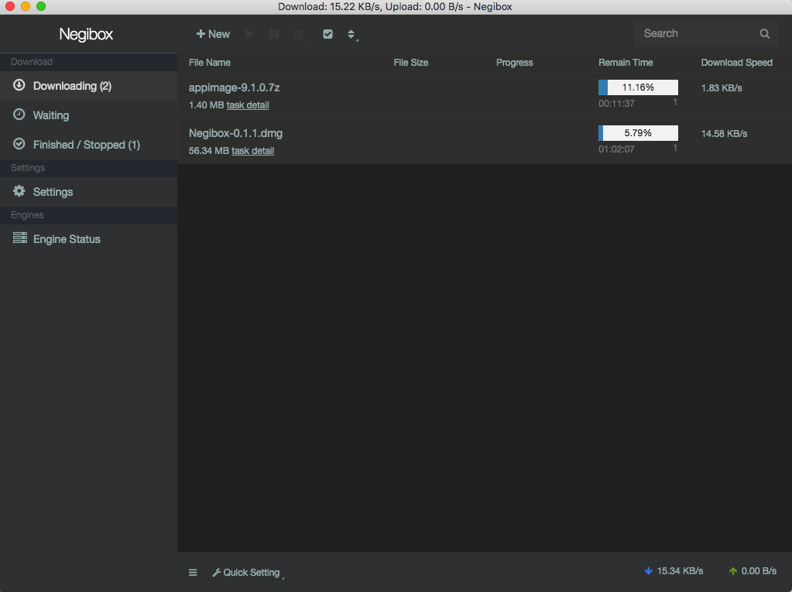
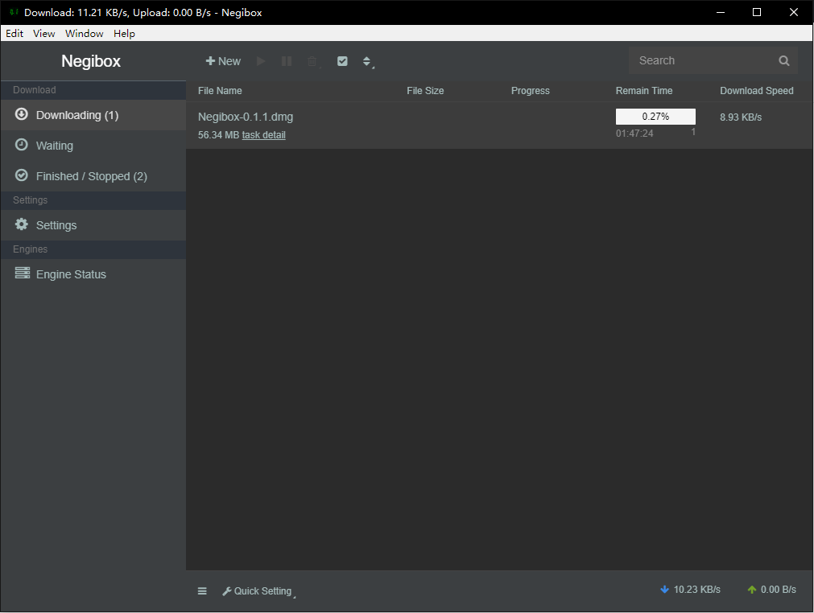
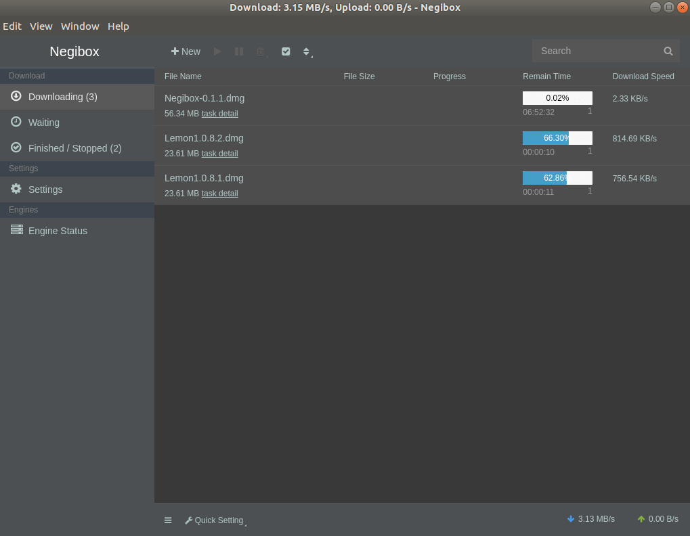

[中文文档](https://github.com/hugetiny/negibox/blob/master/READMECN.md)

<h1 align="center">
   
  
   
  Negibox
   
   
</h1>

<h4 align="center">The best cross-platform(Mac,Windows,Linux,Android,iOS) downloader ever</h4>

  
  
  
  
  

### Recommended Install
Download the latest version of WebTorrent Desktop from
[Negibox.com](https://negibox.com):
>[Please feel free to submit issue](https://github.com/hugetiny/negibox/issues/new)

## Supported OS

- [x] macOS 10.10 and above

   
  

- [x] Windows 7 and above

   
  

For Linux users:  App is packaged in AppImage and requires FUSE to run.
All linux platforms(RHEL, CentOS, openSUSE, SLED, Ubuntu, Fedora, debian and derivatives) could run properly.
GUI is required to run Negibox ,GNOME or KDE desktop is recommended.

- [x] Ubuntu 12.04 and above

   
  

- [x] CentOS 7 and above

- [x] Fedora 21 and newer

- [ ] iOS -- developing
- [ ] Android -- developing

- [ ] html5 -- 0%

## Supported Browser

- [ ] chrome/chromium
- [ ] firefox
- [ ] safari

## Supported Protocol

- [x] http
- [x] https
- [x] ftp
- [x] sftp
- [ ] ftps
- [x] magnet

## Protocols

- [x] http
- [x] https
- [x] ftp
- [x] sftp
- [ ] ftps
- [x] magnet
- [x] bittorrent

## could & service

- [ ] could files
- [ ] could videos player with danmaku
- [ ] cloud music
- [ ] could cross-platform apps

## crowdfunding & sponsor

thank you for supporting my dream to be the next Steam

