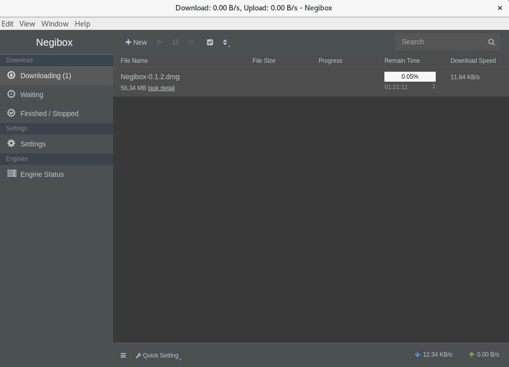

[English Doc](https://github.com/hugetiny/negibox/blob/master/README.md)

<h1 align="center">
   
  
   
  Negibox
   
   
</h1>

<h4 align="center">Negibox葱葱盒子 做世界做好的跨平台下载平台</h4>

  
  
  
  
  

## Recommended Install
从[Negibox.com](https://negibox.com)下载最新版客户端
>[如果发现bug，请在issue提出，我们会及时修复](https://github.com/hugetiny/negibox/issues/new)

## 适配进度

- [x] macOS 10.10 及以上

  
     
     

- [x] Windows 7 及以上

  
     
     

Linux用户:  Negibox用AppImage打包.理论上支持所有linux平台(Debian|Ubuntu|Gentoo|Fedora|RHEL 6|OpenSUSE|OpenELEC|CentOS|RHEL 7|SLES10|SLES11|FreeBSD|Fedora|RHEL|NetBSD和其他衍生平台).
运行Negibox必须安装GUI,推荐GNOME或KDE.

  
     

  
     

  
     
     

- [ ] iOS -- 开发中
- [ ] Android -- 开发中

- [ ] 微信小程序 -- 0%
- [ ] 支付宝小程序 -- 0%
- [ ] 百度小程序 -- 0%
- [ ] 字节跳动小程序 -- 0%
- [ ] 快应用 -- 0%

- [ ] html5 -- 0%

## 浏览器插件支持

- [ ] chrome，包括（UC浏览器，360浏览器，搜狗浏览器等, QQ浏览器等以chromium为核心的浏览器）
- [ ] firefox
- [ ] safari

## 下载协议支持

- [x] http
- [x] https
- [x] ftp
- [x] sftp
- [ ] ftps
- [x] magnet
- [x] BitTorrent
- [x] MetaLink
- [x] thunder 迅雷
- [x] flashget 快车
- [x] qqdl QQ旋风

## 云端&后台功能

- [ ] 路由器/NAS/云端文件下载，同步，
- [ ] 云视频聚合，弹幕播放器
- [ ] 云音乐聚合 -- 10%
- [ ] 云软件管家，App市场聚合

## 众筹&赞助

感谢支持平凡前端的梦想，
如果有一天能做成比Steam+迅雷+云音乐这样的伟大的跨平台全功能平台，
所有在众筹期间的赞助者将收到发送3倍价值的无条件抵用券

 

