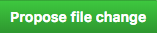
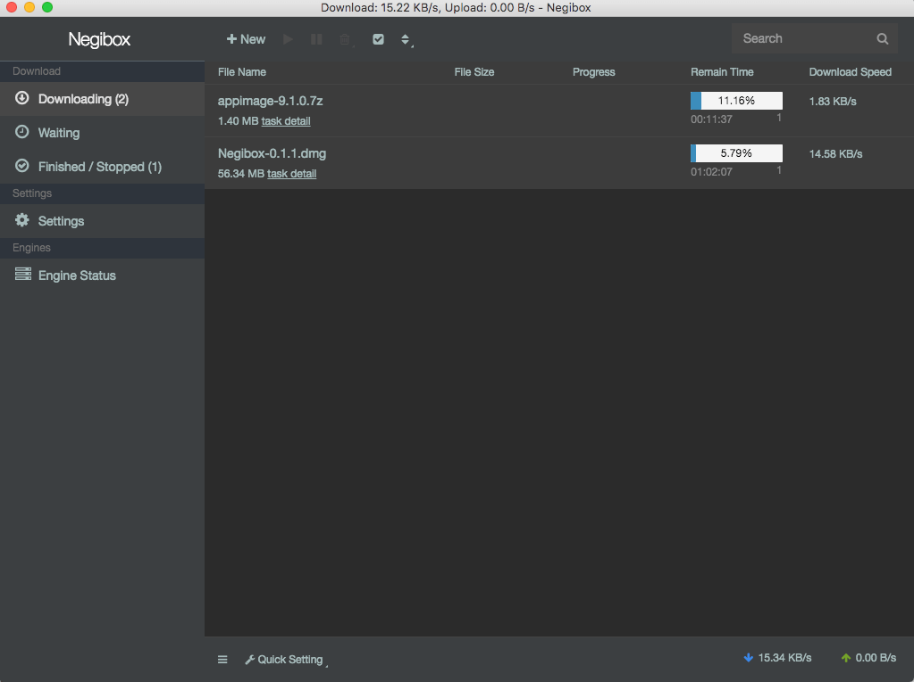
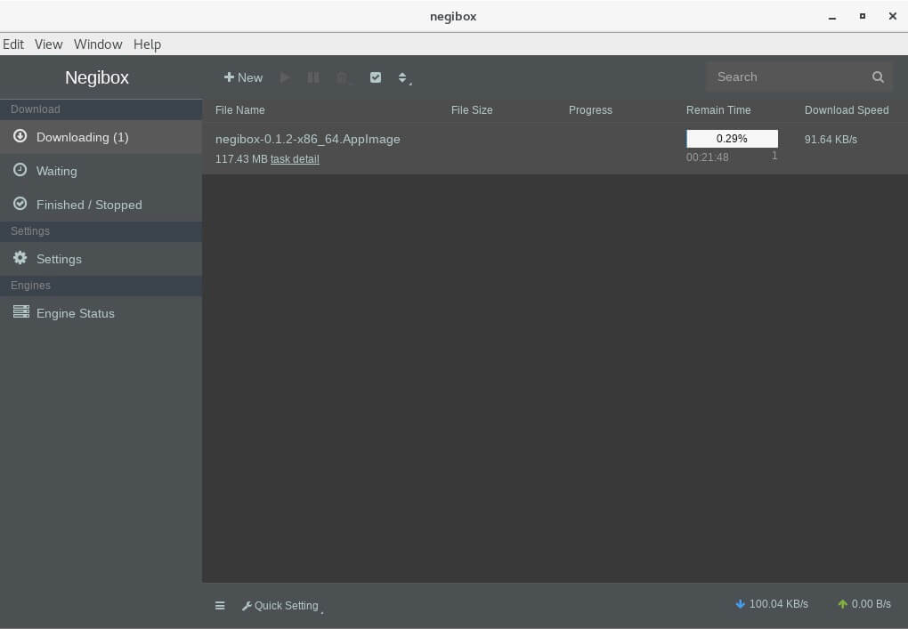
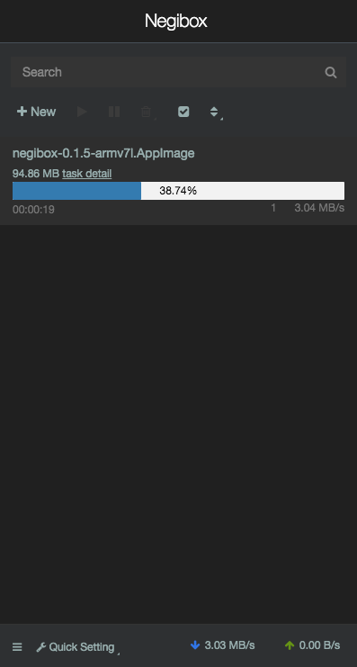

[English]() |
[中文简体]() |
[中文繁体]() |
[Nederlands]() |
[Français]() |
[Deutsch]() |
[Italiano]() |
[Protuguês]() |
[Español]() |
[Russian]() |
[Polski]() |
[ไทย]() |
[Türkçe]() |
[فارسی]() |
[čeština]() |
[Indonesian]()

## Please help us to improve translatation for this page and [Negibox Deutsch](https://github.com/hugetiny/negibox/blob/master/translate/de_DE.js)
#### step0:
[Github](https://github.com/hugetiny/negibox/blob/master/READMEDE.md)

#### step1:
click the pencil in top right corner  to fork this project and edit the file

#### step2:
fix the text to right translation and click

#### step3:
click

and

#### We will merge pull requests to docs and Negibox as soon as we can.

<h1 align="center">
    
   
  Negibox
   
   
</h1>
<h4 align="center">The best cross-platform(Mac,Windows,Linux,Android,iOS) downloader ever</h4>

  
  
  

### Recommended Install
Download the latest version of Negibox Desktop from [github release](https://github.com/hugetiny/negibox/releases)
>[Please feel free to submit issue](https://github.com/hugetiny/negibox/issues/new)

## Supported OS

- [x] macOS 10.10 and above

  
     
     

- [x] Windows 7 and above

  
     
     

- [x] For Linux users:  App is packaged in AppImage and requires FUSE to run.All linux platforms should run properly.GUI is required to run Negibox ,GNOME or KDE desktop is recommended.

                
                
                
                
                
                
                 

  
     

  
     

  
     
     

- [ ] iOS -- developing
- [ ] Android -- developing

  
     
     

##### remote control
- [ ] html5 -- 0%

## Browser Extension
- [ ] chrome/chromium
- [ ] firefox
- [ ] safari

## Protocol

- [x] http
- [x] https
- [x] ftp
- [x] sftp
- [ ] ftps
- [x] magnet
- [x] BitTorrent
- [x] MetaLink

## could & service

- [ ] cloud files router/NAS remote control
- [ ] cloud videos player with danmaku
- [ ] cloud music
- [ ] cloud cross-platform apps

## crowdfunding & sponsor

thank you for your support

